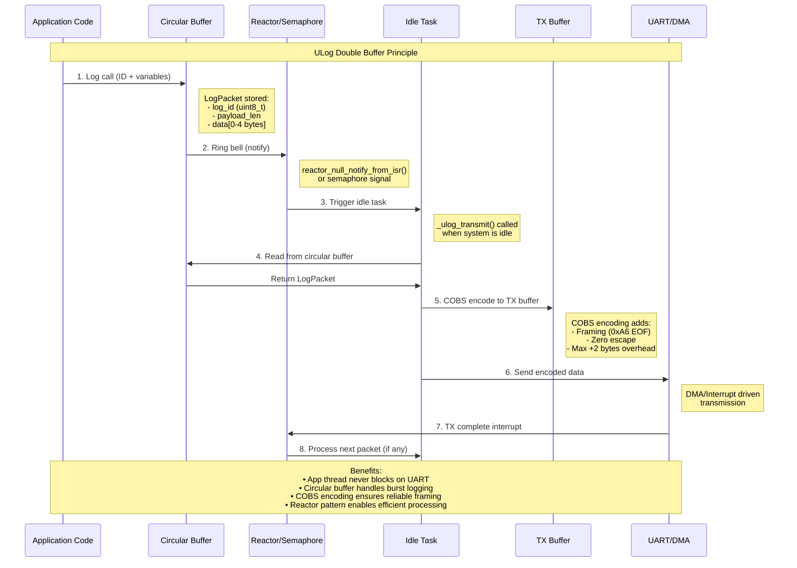

ULog the µ logger for realtime, baremetal or resource constrained operating environment

## Description

ulog is a minimal, portable logging library designed for microcontrollers, bare‑metal systems, and other resource‑constrained environments.
It focuses on a tiny footprint, predictable runtime, and flexible transport backends so it can be used in realtime or no‑OS projects.
It does not require tooling or specific build steps and kills any other system.

### Key features
- Extremely small code and data size (configurable at compile time)
- Optional compile‑time log level filtering to remove unused messages
- Zero or minimal dynamic allocation; suitable for static + stack use
- Pluggable backends (UART, ring buffer, memory buffer, custom callback)
- Optional timestamping and source metadata (file/line) when enabled
- Open content formatting, from none, to full fledged Python expressions
- Configurable thread/interrupt safety primitives or lock‑free operation
- Format using powerfull format specifier
- Compatible C11 and C++17

ULOG provides **real-time safe logging** with:

| Feature | Specification |
|---------|---------------|
| ✅ **Ultra-fast execution** | 6.2µs per call @20MHz |
| ✅ **Predictable latency** | Fixed 124-cycle execution path |
| ✅ **Tiny footprint** | From 6 bytes per log! |
| ✅ **Tiny library** | 760 bytes flash, 113 bytes RAM |
| ✅ **High throughput** | 161k calls/second capacity |
| ✅ **Printf alternative** | Similar interface, 65-121× faster |
| ✅ **Enhanced formatting** | Automatic and enhanced Python like formatting |

### Design goals
- Predictable, bounded latency for realtime systems
- Easy integration into bootloader, kernel, or application code
- Works in interrupts
- Compile time configuration
- Single-header or tiny C module for straightforward inclusion
- Extremly Low bandwidth required for the communication channel
   - >1500 logs/sec on a UART at 115200
   - Suitable for RPMsg channel

## Quick Usage Example

### C++ Implementation (Template-based)
```cpp
#include "ulog.hpp"

int main(void) {
   ULOG_INFO("System initialized");
   ULOG_DEBUG("Temperature: ['blue' if t < 10 else 'red' if t > 50 else 'green'}]{:.1f}[/{'blue' if t < 10 else 'red' if t > 50 else 'green'}]", temp_sensor);
   ULOG_WARN("Position: {},{}", x_pos, y_pos);
   while (1) { /* ... */ }
}
```

### C Implementation (Type-wrapped)
```c
#include "ulog.h"

int main(void) {
   ULOG_INFO("System initialized");
   ULOG_DEBUG("Temperature: {}", temp_sensor);
   ULOG_WARN("Position: {},{}", x_pos, y_pos);
   while (1) { /* ... */ }
}
```

### Real-World Performance

**At 20MHz AVR:**

| Metric | Value |
|--------|-------|
| Execution time | 124 cycles = **6.2 µs per call** |
| Maximum throughput | **161,290 calls/second** @ 100% CPU load |
| Practical rate | **161 calls/millisecond** |

**Compared to printf():**

| Implementation | Time (µs) | Cycles | Performance Gain |
|----------------|-----------|--------|------------------|
| **ULOG** | 6.2 | 124 | Baseline |
| **printf()** | 400-750 | 8,000-15,000 | **65-121× slower** |

### CPU Utilization Examples

| Usage Scenario | Loop Period | CPU Impact | Recommendation |
|----------------|-------------|------------|----------------|
| 1Hz system status | 1000ms | 0.0006% | ✅ Excellent |
| 1kHz control loop | 1ms | 0.62% | ✅ Good |
| 10kHz fast control | 100µs | 6.2% | ⚠️ Moderate |
| 50kHz ultra-fast | 20µs | 31% | ❌ Too heavy |

Perfect for embedded real-time applications requiring extensive debugging and telemetry without performance compromise.

### Maximum UART throughput

The maximum UART throughput depends on the baud rate and packet efficiency:

| Baud Rate | Max Throughput | ULOG Packets/sec |
|-----------|----------------|------------------|
| 115,200 | 11.5 KB/s | ~1,900 packets/s |
| 460,800 | 46 KB/s | ~7,600 packets/s |
| 921,600 | 92 KB/s | ~15,200 packets/s |
| 2,000,000 | 200 KB/s | ~33,000 packets/s |

*Assuming 6-byte average packet size including framing overhead*

## Implementation Approaches

ULog builds on the principle that 90% of the information needs to log is known at compile time and
need not be processed nor transmitted.
The known information are:
 * File name of the log statement
 * Line mumber
 * Log string, with formatter
 * Number and types (traits) of the variables of interest

Based on this, all that is required is a unique ID for the log.

ulog uses the linker to create the log.

Unlike other logger - ulog does not require post compile processing! and you log right after link.

# ULog Double Buffer System

The ulog system implements a double buffer principle to ensure real-time logging with minimal blocking:



## Buffer Structure Details

### Circular Buffer (Primary Buffer)
```
LogPacket logs_circular_buffer[QUEUE_DEPTH]

typedef struct {
    uint8_t payload_len;        // Total length (1 + data bytes)
    union {
        struct {
            uint8_t id;         // Log message ID
            uint8_t data[4];    // Variable data (0-4 bytes)
        };
        uint8_t payload[5];     // Raw payload view
    };
} LogPacket;
```

### TX Buffer (Secondary Buffer)
```
uint8_t tx_encoded[MAX_PAYLOAD + sizeof(uint8_t) + 2]

• COBS encoded output buffer
• Worst case: original data + 2 bytes overhead
• Contains framed, zero-escaped data ready for UART
```

## Flow Control

1. **Enqueue Phase** (Fast, O(1))
   - Application calls `ULOG_INFO("msg", args...)`
   - Data packed into circular buffer slot
   - Bell rung via `reactor_null_notify_from_isr()`
   - Returns immediately (non-blocking)

2. **Dequeue Phase** (Idle time)
   - Reactor triggers `_ulog_transmit()` when idle
   - Read packet from circular buffer
   - COBS encode into TX buffer
   - Initiate UART/DMA transmission

3. **Transmission Phase** (Async)
   - UART sends data via DMA/interrupt
   - On completion, trigger next packet processing
   - Process continues until circular buffer empty

## Key Benefits

- **Real-time Safe**: Application logging never blocks on slow UART
- **Burst Handling**: Circular buffer absorbs logging bursts
- **Reliable Framing**: COBS encoding prevents data corruption
- **Efficient**: Only processes when system is idle
- **Overrun Protection**: Tracks and reports buffer overflow conditions
- **Minimal Footprint**: Configurable buffer sizes, no dynamic allocation

## How to use

Include the library into your project.

